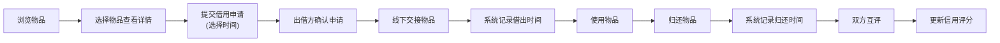
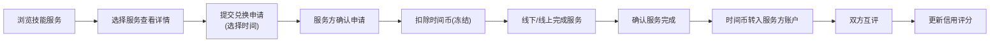
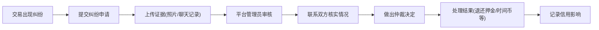

## 1. 产品概述

邻里物品共享与技能交换时间银行平台，致力于解决社区内闲置物品浪费和技能资源不均衡问题。用户可以共享闲置物品（工具、家电、运动器材等），也可以发布技能服务赚取"时间币"，并用时间币兑换他人服务。平台建立信用评分体系和纠纷仲裁流程，保障交易安全。

- 目标用户：社区居民、邻里之间有物品共享或技能交换需求的人群
- 核心价值：促进邻里互助、减少资源浪费、建立社区信任网络

## 2. 核心功能

### 2.1 用户角色

| 角色 | 注册方式 | 核心权限 |
|------|----------|----------|
| 普通用户 | 手机号/邮箱注册 | 发布物品、发布技能、申请借用、兑换服务、信用评价 |
| 平台管理员 | 后台登录 | 用户管理、纠纷仲裁、平台配置、数据统计 |

### 2.2 功能模块

1. **首页**：物品推荐、技能推荐、平台公告、快捷入口
2. **物品共享**：物品列表、物品详情、发布物品、借用申请、借出/归还管理
3. **技能交换**：技能列表、技能详情、发布技能、服务申请、时间币交易
4. **个人中心**：我的物品、我的技能、我的订单、时间币账户、信用评分
5. **信用体系**：信用评分展示、评价记录、信用等级
6. **纠纷仲裁**：纠纷提交、纠纷列表、仲裁处理

### 2.3 页面详情

| 页面名称 | 模块名称 | 功能描述 |
|----------|----------|----------|
| 首页 | Hero区域 | 平台介绍、核心价值展示、统计数据 |
| 首页 | 物品推荐 | 热门闲置物品卡片展示，支持分类筛选 |
| 首页 | 技能推荐 | 热门技能服务卡片展示，支持分类筛选 |
| 物品列表页 | 筛选区 | 按分类、价格、押金、距离筛选 |
| 物品列表页 | 物品卡片 | 展示物品图片、名称、押金、借用规则、发布者信息 |
| 物品详情页 | 物品信息 | 图片轮播、详细描述、借用规则、押金说明 |
| 物品详情页 | 申请借用 | 选择借用时间、提交申请 |
| 发布物品页 | 表单区 | 上传图片、填写信息、设置规则和押金 |
| 技能列表页 | 筛选区 | 按分类、时间币价格、距离筛选 |
| 技能列表页 | 技能卡片 | 展示服务图片、名称、时间币价格、服务说明 |
| 技能详情页 | 技能信息 | 详细描述、服务范围、时间币定价 |
| 技能详情页 | 预约服务 | 选择服务时间、提交兑换申请 |
| 发布技能页 | 表单区 | 上传图片、填写服务信息、设置时间币价格 |
| 个人中心 | 用户信息 | 头像、昵称、信用等级、时间币余额 |
| 个人中心 | 我的物品 | 管理发布的物品、查看借用申请 |
| 个人中心 | 我的技能 | 管理发布的技能、查看服务订单 |
| 个人中心 | 订单管理 | 借用/借出订单、服务/兑换订单、时间线记录 |
| 个人中心 | 信用评分 | 信用分数、评价记录、信用等级说明 |
| 纠纷仲裁 | 纠纷列表 | 待处理、处理中、已完成的纠纷 |
| 纠纷仲裁 | 提交纠纷 | 选择订单、描述问题、上传证据 |
| 纠纷仲裁 | 纠纷详情 | 查看纠纷信息、仲裁进度、处理结果 |
| 登录页 | 登录表单 | 手机号/邮箱登录、注册入口 |
| 注册页 | 注册表单 | 填写信息、验证手机/邮箱 |

## 3. 核心流程

### 3.1 物品借用流程

### 3.2 技能交换流程

### 3.3 纠纷仲裁流程

## 4. 用户界面设计

### 4.1 设计风格

- **主色调**：温暖橙红色 (#E67E22) - 象征邻里互助、热情友好
- **辅助色**：自然绿色 (#27AE60) - 象征环保、共享、信任
- **中性色**：暖灰色系 (#F5F5F0, #333333) - 营造温馨社区感
- **按钮风格**：圆角矩形，微立体阴影，hover时有轻微上浮效果
- **字体**：标题使用"Noto Serif SC"宋体类字体营造社区温度，正文使用"Noto Sans SC"保证可读性
- **布局风格**：卡片式布局，柔和圆角，舒适留白，暖色调背景
- **图标风格**：线性图标，使用lucide-react，统一2px线条宽度

### 4.2 页面设计概述

| 页面名称 | 模块名称 | UI元素 |
|----------|----------|--------|
| 首页 | Hero区域 | 大标题、社区氛围背景图、渐变叠加、核心数据统计、动画入场 |
| 首页 | 物品推荐 | 卡片网格布局、悬停放大效果、标签角标、平滑过渡 |
| 首页 | 技能推荐 | 卡片网格布局、时间币标识、发布者信用等级 |
| 列表页 | 筛选区 | 标签式分类、滑动选择器、悬浮筛选按钮 |
| 详情页 | 信息区 | 图片轮播、渐变蒙版、信息层级清晰、时间轴展示借用记录 |
| 表单页 | 表单区 | 分段式表单、实时预览、进度指示器、友好错误提示 |
| 个人中心 | 信息区 | 圆形头像、信用等级徽章、时间币余额卡片、渐变背景 |
| 订单页 | 时间线 | 垂直时间线、状态节点、颜色区分状态、流畅过渡动画 |

### 4.3 响应式设计

- **桌面优先**：默认1280px以上宽屏设计，4列卡片网格
- **平板适配**：768px-1279px，3列卡片网格，侧边栏改为顶部标签
- **手机适配**：768px以下，1-2列卡片网格，底部导航栏，优化触控区域
- **触摸优化**：按钮最小尺寸48x48px，手势滑动支持图片轮播和标签切换

### 4.4 动效设计

- 页面加载：元素交错淡入入场，staggered animation
- 卡片悬停：轻微上浮 + 阴影加深 + 图片微缩放
- 按钮点击：scale(0.97) 按压反馈
- 状态切换：平滑过渡动画，duration 200-300ms
- 时间线：滚动触发节点点亮动画
