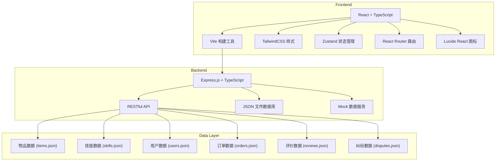
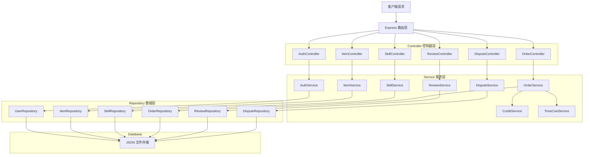
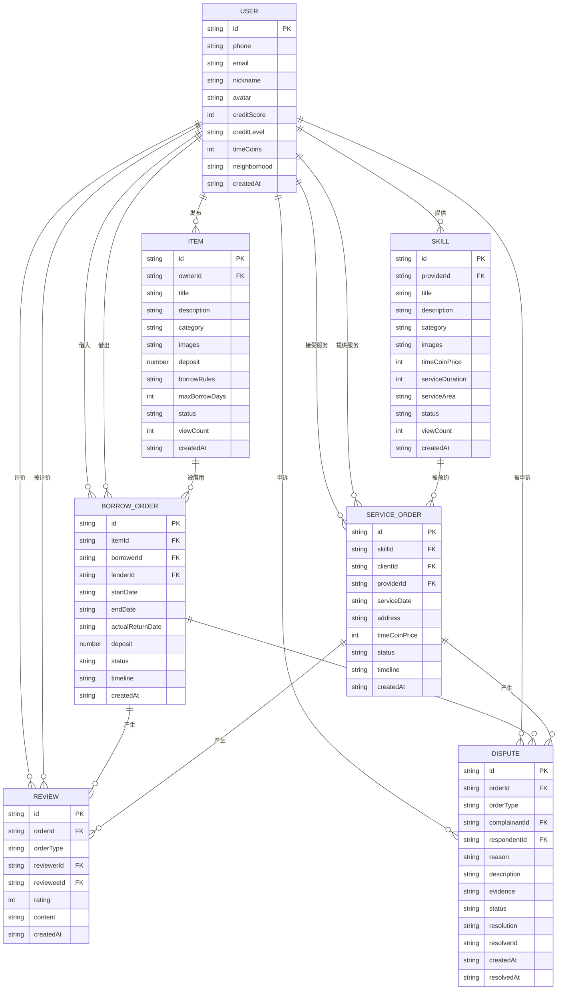

## 1. 架构设计



## 2. 技术描述

- **前端**：React@18 + TypeScript + TailwindCSS@3 + Vite + Zustand + React Router DOM
- **后端**：Express@4 + TypeScript
- **数据库**：JSON 文件存储（便于开发演示，生产环境可升级为 PostgreSQL）
- **状态管理**：Zustand 轻量级状态管理
- **路由**：React Router DOM v6
- **图标**：lucide-react
- **初始化工具**：vite-init react-express-ts 模板

## 3. 路由定义

| 路由路径 | 页面名称 | 权限 |
|----------|----------|------|
| / | 首页 | 公开 |
| /items | 物品列表页 | 公开 |
| /items/:id | 物品详情页 | 公开 |
| /items/publish | 发布物品页 | 需登录 |
| /skills | 技能列表页 | 公开 |
| /skills/:id | 技能详情页 | 公开 |
| /skills/publish | 发布技能页 | 需登录 |
| /profile | 个人中心首页 | 需登录 |
| /profile/items | 我的物品 | 需登录 |
| /profile/skills | 我的技能 | 需登录 |
| /profile/orders | 订单管理 | 需登录 |
| /profile/credit | 信用评分 | 需登录 |
| /disputes | 纠纷列表 | 需登录 |
| /disputes/:id | 纠纷详情 | 需登录 |
| /disputes/create | 提交纠纷 | 需登录 |
| /login | 登录页 | 公开 |
| /register | 注册页 | 公开 |
| /admin | 管理员后台 | 管理员 |

## 4. API 定义

```typescript
// 通用响应类型
interface ApiResponse<T> {
  success: boolean;
  data?: T;
  message?: string;
}

// 用户相关类型
interface User {
  id: string;
  phone: string;
  email: string;
  nickname: string;
  avatar: string;
  creditScore: number;
  creditLevel: string;
  timeCoins: number;
  createdAt: string;
  neighborhood: string;
}

interface LoginRequest {
  phone?: string;
  email?: string;
  password: string;
}

interface RegisterRequest {
  phone: string;
  email: string;
  nickname: string;
  password: string;
  neighborhood: string;
}

// 物品相关类型
interface Item {
  id: string;
  ownerId: string;
  owner: User;
  title: string;
  description: string;
  category: string;
  images: string[];
  deposit: number;
  borrowRules: string;
  maxBorrowDays: number;
  status: 'available' | 'borrowed' | 'maintenance';
  createdAt: string;
  viewCount: number;
}

interface BorrowRequest {
  itemId: string;
  startDate: string;
  endDate: string;
  message?: string;
}

// 技能相关类型
interface Skill {
  id: string;
  providerId: string;
  provider: User;
  title: string;
  description: string;
  category: string;
  images: string[];
  timeCoinPrice: number;
  serviceDuration: number;
  serviceArea: string;
  status: 'active' | 'inactive';
  createdAt: string;
  viewCount: number;
}

interface ServiceOrderRequest {
  skillId: string;
  serviceDate: string;
  address: string;
  message?: string;
}

// 订单相关类型
interface BorrowOrder {
  id: string;
  itemId: string;
  item: Item;
  borrowerId: string;
  borrower: User;
  lenderId: string;
  lender: User;
  startDate: string;
  endDate: string;
  actualReturnDate?: string;
  deposit: number;
  status: 'pending' | 'approved' | 'rejected' | 'borrowing' | 'returned' | 'disputed';
  timeline: TimelineEvent[];
  createdAt: string;
}

interface ServiceOrder {
  id: string;
  skillId: string;
  skill: Skill;
  clientId: string;
  client: User;
  providerId: string;
  provider: User;
  serviceDate: string;
  address: string;
  timeCoinPrice: number;
  status: 'pending' | 'approved' | 'rejected' | 'in_progress' | 'completed' | 'disputed';
  timeline: TimelineEvent[];
  createdAt: string;
}

interface TimelineEvent {
  time: string;
  event: string;
  operator: string;
}

// 评价相关类型
interface Review {
  id: string;
  orderId: string;
  orderType: 'borrow' | 'service';
  reviewerId: string;
  reviewer: User;
  revieweeId: string;
  reviewee: User;
  rating: number;
  content: string;
  createdAt: string;
}

// 纠纷相关类型
interface Dispute {
  id: string;
  orderId: string;
  orderType: 'borrow' | 'service';
  order: BorrowOrder | ServiceOrder;
  complainantId: string;
  complainant: User;
  respondentId: string;
  respondent: User;
  reason: string;
  description: string;
  evidence: string[];
  status: 'pending' | 'reviewing' | 'resolved';
  resolution?: string;
  resolverId?: string;
  createdAt: string;
  resolvedAt?: string;
}
```

### API 端点

| 方法 | 路径 | 描述 | 权限 |
|------|------|------|------|
| POST | /api/auth/login | 用户登录 | 公开 |
| POST | /api/auth/register | 用户注册 | 公开 |
| GET | /api/auth/profile | 获取当前用户信息 | 需登录 |
| GET | /api/items | 获取物品列表 | 公开 |
| GET | /api/items/:id | 获取物品详情 | 公开 |
| POST | /api/items | 发布物品 | 需登录 |
| PUT | /api/items/:id | 更新物品信息 | 需登录 |
| POST | /api/items/:id/borrow | 申请借用 | 需登录 |
| GET | /api/skills | 获取技能列表 | 公开 |
| GET | /api/skills/:id | 获取技能详情 | 公开 |
| POST | /api/skills | 发布技能 | 需登录 |
| PUT | /api/skills/:id | 更新技能信息 | 需登录 |
| POST | /api/skills/:id/book | 预约服务 | 需登录 |
| GET | /api/orders/borrow | 借用订单列表 | 需登录 |
| PUT | /api/orders/borrow/:id/approve | 同意借用 | 需登录 |
| PUT | /api/orders/borrow/:id/reject | 拒绝借用 | 需登录 |
| PUT | /api/orders/borrow/:id/lend | 确认借出 | 需登录 |
| PUT | /api/orders/borrow/:id/return | 确认归还 | 需登录 |
| GET | /api/orders/service | 服务订单列表 | 需登录 |
| PUT | /api/orders/service/:id/approve | 同意服务 | 需登录 |
| PUT | /api/orders/service/:id/reject | 拒绝服务 | 需登录 |
| PUT | /api/orders/service/:id/complete | 确认完成 | 需登录 |
| GET | /api/reviews/:userId | 用户评价列表 | 公开 |
| POST | /api/reviews | 提交评价 | 需登录 |
| GET | /api/disputes | 纠纷列表 | 需登录 |
| GET | /api/disputes/:id | 纠纷详情 | 需登录 |
| POST | /api/disputes | 提交纠纷 | 需登录 |
| PUT | /api/disputes/:id/resolve | 处理纠纷 | 管理员 |

## 5. 服务器架构图



## 6. 数据模型

### 6.1 ER 图



### 6.2 初始化数据

项目将包含完整的 mock 数据，包括：
- 10+ 个示例用户（包含不同信用等级）
- 20+ 个示例物品（工具、家电、运动器材等分类）
- 15+ 个示例技能服务
- 若干历史订单、评价和纠纷案例
